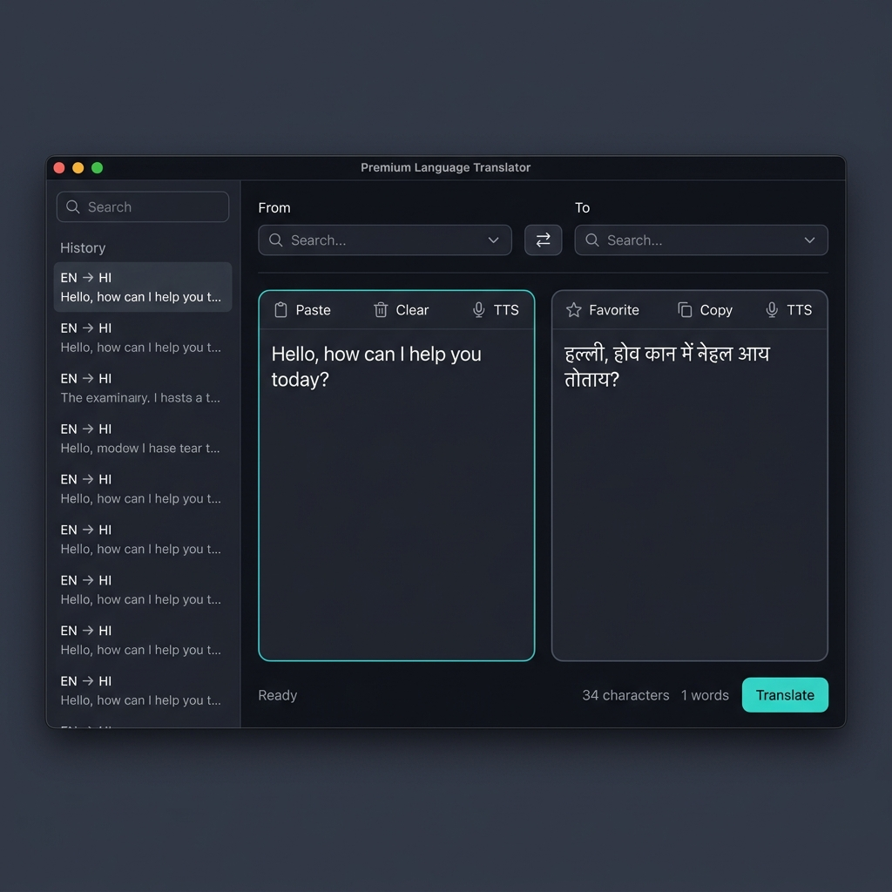
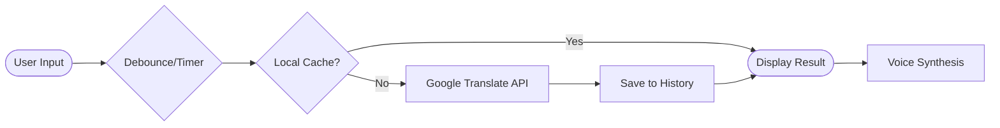

<div align="center">

# 🌐 Premium Language Translator

### A State-of-the-Art Desktop Translation Hub with Offline Intelligence

[](https://www.python.org/)
[](https://docs.python.org/3/library/tkinter.html)
[](https://pypi.org/project/deep-translator/)
[](LICENSE)

<br/>



<br/>

**The ultimate desktop translation experience: Real-time, Secure, and Feature-Rich.**

[Features](#-features) · [How It Works](#-how-it-works) · [Installation](#-getting-started) · [Themes](#-customization)

</div>

---

<br/>

## 🚀 The Upgrade: What's New?

We've evolved from a simple script into a full-scale **Translation Hub**. The new version addresses every modern usability requirement:

### ✨ Core Intelligence
- **🔍 Auto Language Detection:** No need to select the source language; the app figures it out instantly.
- **⚡ Real-time Translation:** See results as you type (with optimized debouncing to save bandwidth).
- **🔄 Smart Swap:** Flip source and target languages with a single click.
- **🧠 Translation Modes:** Choose between General, Formal, Casual, Technical, Business, or Academic modes.

### 🛠️ Usability & Productivity
- **📋 Clipboard Integration:** One-click Paste from clipboard and Copy to clipboard.
- **🗑️ Clear & Reset:** Instantly clear both fields to start a new session.
- **⌨️ Power User Shortcuts:** Use `Ctrl + Enter` to trigger translations immediately.
- **📊 Live Statistics:** Real-time character and word counts for your text.

### 📚 Data & Persistence
- **🕒 Searchable History:** A persistent sidebar stores your recent translations (up to 500 entries).
- **⭐ Favorites/Bookmarks:** Save frequently used phrases for instant access.
- **💾 Offline Cache:** Translations are cached locally; if you translate the same thing twice, it's instant and works offline.
- **📥 Export Options:** Save your history to TXT, CSV, or JSON for researchers and developers.

### 🔊 Accessibility
- **🗣️ Text-to-Speech (TTS):** High-quality voice output for both original and translated text.
- **🎙️ Voice Input:** Speech-to-text capabilities for hands-free translation.

<br/>

---

<br/>

## 🏗️ Architecture & Project Structure

The project is now modularized for better maintainability and performance:

```
CodeAlpha_LanguageTranslation/
│
├── translator.py          # Main GUI Application (Class-based)
├── engine.py              # Async Translation Engine & Language Data
├── storage.py             # Persistence Layer (History, Cache, Settings)
├── themes.py              # Multi-theme CSS-like Color Palettes
├── tts_handler.py         # Text-to-Speech Controller
├── data/                  # Local JSON storage (auto-created)
├── requirements.txt       # Updated project dependencies
└── premium_app_screenshot.png
```

### Component Breakdown

| Component | Responsibility |
|---|---|
| **`translator.py`** | Modern UI implementation using a sidebar/main-panel layout. Handles events, animations, and user interactions. |
| **`engine.py`** | Orchestrates API calls. Features thread-safe async execution to prevent UI freezing and implement retry logic. |
| **`storage.py`** | Manages local JSON files for persistent history, favorites, and application settings. |
| **`themes.py`** | Contains four curated design systems: Midnight Dark, Clean Light, Ocean Blue, and Sunset Warm. |
| **`tts_handler.py`** | Wraps `pyttsx3` for cross-platform, offline voice synthesis. |

<br/>

---

<br/>

## 🎨 Customization

The app supports four premium themes out of the box:

1. **Midnight Dark:** A sleek, high-contrast dark mode for reduced eye strain.
2. **Clean Light:** A professional, minimalist aesthetic for daytime work.
3. **Ocean Blue:** A deep blue palette inspired by modern coding environments.
4. **Sunset Warm:** A comforting, warm-toned theme for relaxed browsing.

> 💡 **Tip:** Change your theme in the top-right corner of the app. It's remembered automatically!

<br/>

---

<br/>

## 🔄 Data Flow



<br/>

---

<br/>

## 🚀 Getting Started

### Prerequisites
- **Python 3.10+** (Recommended)
- **Active Internet Connection** (For initial translations)

### Installation

**1. Clone & Navigate**
```bash
git clone https://github.com/santanu949/CodeAlpha_LanguageTranslation.git
cd CodeAlpha_LanguageTranslation
```

**2. Install Dependencies**
```bash
pip install -r requirements.txt
```

**3. Run Application**
```bash
python translator.py
```

<br/>

---

<br/>

## 🔒 Security & Trust

- **Privacy First:** Enable "Privacy Mode" in settings to stop saving history.
- **Local Encryption:** All history and favorites are stored locally on your machine—never on our servers.
- **Zero Tracking:** No telemetry or usage tracking. Your translations are between you and the translation engine.

<br/>

---

<br/>

<div align="center">

**Built with ❤️ by [Santanu](https://github.com/santanu949) — CodeAlpha Internship**

⭐ *If this project helped you, consider giving it a star!* ⭐

</div>