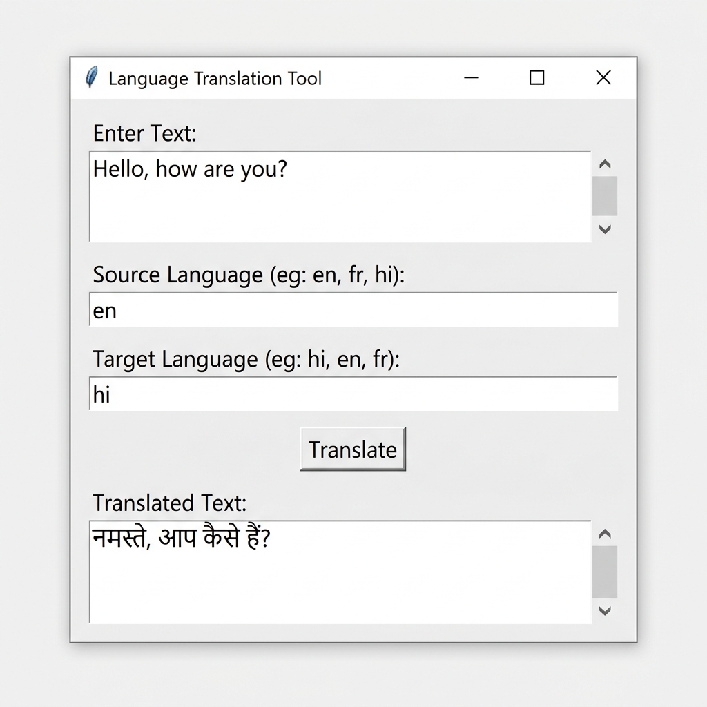
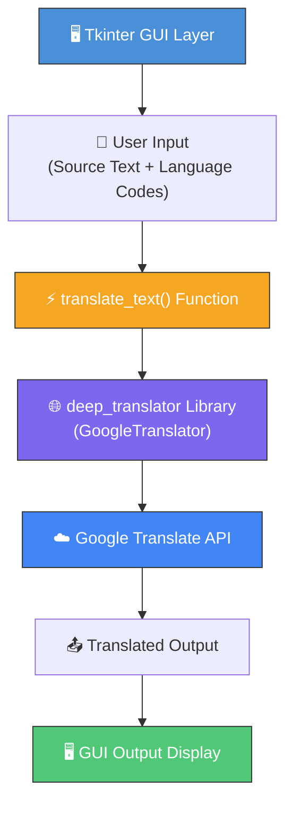

<div align="center">

# 🌐 Language Translation Tool

### A Real-Time Desktop Translation Application Powered by Google Translate

[](https://www.python.org/)
[](https://docs.python.org/3/library/tkinter.html)
[](https://translate.google.com/)
[](LICENSE)
[](https://www.codealpha.tech/)

<br/>



<br/>

**Translate text between 133+ languages instantly — no API key required.**

[Getting Started](#-getting-started) · [How It Works](#-how-it-works) · [Supported Languages](#-supported-languages) · [Contributing](#-contributing)

</div>

---

<br/>

## 📖 About The Project

The **Language Translation Tool** is a lightweight desktop application built as part of the **CodeAlpha Python Programming Internship**. It provides instant, accurate text translation between **133+ languages** using the Google Translate engine — all from a clean, native graphical interface.

### Why This Project?

| Problem | Solution |
|---|---|
| Browser-based translators require constant internet tab-switching | A **standalone desktop app** — always one click away |
| Most translation APIs need registration and API keys | Uses **Google Translate** under the hood — **zero setup, no API key** |
| Command-line translation tools lack accessibility | A **visual GUI** anyone can use regardless of technical skill |
| Complex translation libraries with steep learning curves | **Under 40 lines of clean Python** — easy to read, modify, and learn from |

### Where Can This Be Used?

- 🎓 **Students** — Quickly translate study material, research papers, or foreign-language content
- 💼 **Professionals** — Draft emails, messages, or documents in another language
- 🌍 **Travelers** — Prepare phrases and sentences before visiting a new country
- 👨‍💻 **Developers** — Learn how to integrate translation APIs and build GUI apps with Python
- 📚 **Language Learners** — Practice and verify translations across multiple languages

<br/>

---

<br/>

## 🏗️ Architecture & Project Structure

```
CodeAlpha_LanguageTranslation/
│
├── translator.py          # Main application — GUI + translation logic
├── requirements.txt       # Python package dependencies
├── app_screenshot.png     # Application demo screenshot
└── README.md              # Project documentation (this file)
```

### Component Breakdown

The application is intentionally simple but well-structured. Everything lives in a single file (`translator.py`) for maximum portability:



### How Each Component Works

| Component | File | Role |
|---|---|---|
| **GUI Framework** | `translator.py` (Lines 1, 15–38) | Creates the window, labels, text areas, input fields, and the translate button using Python's built-in `tkinter` module |
| **Translation Engine** | `translator.py` (Lines 2, 4–13) | The `translate_text()` function captures user input, calls the Google Translate API via `deep_translator`, and displays the result |
| **Language Configuration** | `translator.py` (Lines 23–30) | Two `StringVar` entry fields let users specify ISO 639-1 language codes (e.g., `en`, `hi`, `fr`) for source and target |
| **Error Handling** | `translator.py` (Lines 8–11) | A `try/except` block catches translation failures (network errors, invalid codes) and displays a user-friendly error message |

<br/>

---

<br/>

## 🔄 How It Works

Here's the step-by-step data flow when you click **Translate**:

```
┌─────────────────────────────────────────────────────────────────┐
│                        USER INTERACTION                         │
├─────────────────────────────────────────────────────────────────┤
│                                                                 │
│  1. User types text in the "Enter Text" area                    │
│  2. User sets Source Language code (e.g., "en")                 │
│  3. User sets Target Language code (e.g., "hi")                 │
│  4. User clicks the [Translate] button                          │
│                                                                 │
├─────────────────────────────────────────────────────────────────┤
│                      INTERNAL PROCESSING                        │
├─────────────────────────────────────────────────────────────────┤
│                                                                 │
│  5. translate_text() is triggered via button callback           │
│  6. Source text is read from the Text widget                    │
│  7. Source & target language codes are read from Entry widgets   │
│  8. GoogleTranslator(source, target).translate(text) is called  │
│  9. The library sends an HTTP request to Google Translate       │
│ 10. Google returns the translated string                        │
│                                                                 │
├─────────────────────────────────────────────────────────────────┤
│                        OUTPUT DISPLAY                           │
├─────────────────────────────────────────────────────────────────┤
│                                                                 │
│ 11. The output Text widget is cleared                           │
│ 12. Translated text is inserted into the output area            │
│ 13. If an error occurred, "Error: <message>" is shown instead   │
│                                                                 │
└─────────────────────────────────────────────────────────────────┘
```

### Code Walkthrough

```python
# STEP 1: Import dependencies
import tkinter as tk                        # Python's built-in GUI toolkit
from deep_translator import GoogleTranslator # Google Translate wrapper (no API key needed)

# STEP 2: Core translation function (called when button is clicked)
def translate_text():
    src_text = input_text.get("1.0", "end-1c")  # Read all text from input box
    src_lang = src_lang_var.get()                 # Get source language code
    tgt_lang = tgt_lang_var.get()                 # Get target language code
    try:
        translated = GoogleTranslator(source=src_lang, target=tgt_lang).translate(src_text)
    except Exception as e:
        translated = "Error: " + str(e)           # Graceful error handling
    output_text.delete("1.0", "end")              # Clear previous output
    output_text.insert("end", translated)         # Display translated text

# STEP 3: Build the GUI window with input/output areas and controls
# ... (Tkinter widgets: Labels, Text areas, Entry fields, Button)

# STEP 4: Start the application event loop
root.mainloop()
```

<br/>

---

<br/>

## 🚀 Getting Started

### Prerequisites

| Requirement | Minimum Version | Check Command |
|---|---|---|
| **Python** | 3.8+ | `python --version` |
| **pip** | Any recent version | `pip --version` |
| **Internet** | Active connection | Required for Google Translate API |

> **Note:** `tkinter` comes pre-installed with Python on Windows and macOS. On Linux, you may need to install it separately (see [Troubleshooting](#-troubleshooting)).

### Installation

**1. Clone the repository**

```bash
git clone https://github.com/santanu949/CodeAlpha_LanguageTranslation.git
cd CodeAlpha_LanguageTranslation
```

**2. (Optional) Create a virtual environment**

```bash
# Create
python -m venv venv

# Activate (Windows)
venv\Scripts\activate

# Activate (macOS / Linux)
source venv/bin/activate
```

**3. Install dependencies**

```bash
pip install -r requirements.txt
```

**4. Run the application**

```bash
python translator.py
```

The translation tool window will open — start translating immediately! 🎉

<br/>

---

<br/>

## 🌍 Supported Languages

The tool supports **133+ languages** via Google Translate. Here are some commonly used ones:

| Language | Code | | Language | Code | | Language | Code |
|---|---|---|---|---|---|---|---|
| English | `en` | | Hindi | `hi` | | Chinese (Simplified) | `zh-CN` |
| French | `fr` | | Spanish | `es` | | Chinese (Traditional) | `zh-TW` |
| German | `de` | | Italian | `it` | | Japanese | `ja` |
| Portuguese | `pt` | | Russian | `ru` | | Korean | `ko` |
| Arabic | `ar` | | Bengali | `bn` | | Tamil | `ta` |
| Dutch | `nl` | | Turkish | `tr` | | Telugu | `te` |
| Swedish | `sv` | | Polish | `pl` | | Marathi | `mr` |
| Greek | `el` | | Thai | `th` | | Urdu | `ur` |

> 💡 **Tip:** To see the full list of supported languages and their codes, run:
> ```python
> from deep_translator import GoogleTranslator
> print(GoogleTranslator().get_supported_languages(as_dict=True))
> ```

<br/>

---

<br/>

## 🛠️ Tech Stack

| Layer | Technology | Purpose |
|---|---|---|
| **Language** | Python 3.8+ | Core programming language |
| **GUI Framework** | Tkinter | Desktop graphical user interface |
| **Translation Library** | [deep-translator](https://pypi.org/project/deep-translator/) | Wrapper around Google Translate (no API key) |
| **Translation Backend** | Google Translate | Neural machine translation engine |

<br/>

---

<br/>

## ❓ Troubleshooting

| Issue | Solution |
|---|---|
| `ModuleNotFoundError: No module named 'tkinter'` | **Linux:** `sudo apt-get install python3-tk` <br/> **Fedora:** `sudo dnf install python3-tkinter` |
| `ModuleNotFoundError: No module named 'deep_translator'` | Run `pip install deep-translator` |
| Translation returns an error | Check your internet connection and verify language codes are valid |
| Non-Latin characters not displaying | The GUI (Tkinter) supports Unicode — this is typically a terminal-only issue |

<br/>

---

<br/>

## 🤝 Contributing

Contributions are welcome! Here are some ideas to extend this project:

- [ ] Add a **dropdown menu** for language selection instead of manual code entry
- [ ] Add **auto-detect** for the source language
- [ ] Implement **text-to-speech** for the translated output
- [ ] Add a **translation history** panel
- [ ] Create a **dark mode** theme for the GUI
- [ ] Add **copy to clipboard** functionality

**To contribute:**

1. Fork the repository
2. Create a feature branch (`git checkout -b feature/amazing-feature`)
3. Commit your changes (`git commit -m 'Add amazing feature'`)
4. Push to the branch (`git push origin feature/amazing-feature`)
5. Open a Pull Request

<br/>

---

<br/>

## 📄 License

This project is part of the **CodeAlpha Python Programming Internship** and is open source for educational purposes.

<br/>

---

<br/>

<div align="center">

**Built with ❤️ by [Santanu](https://github.com/santanu949) — CodeAlpha Internship**

⭐ *If this project helped you, consider giving it a star!* ⭐

</div>